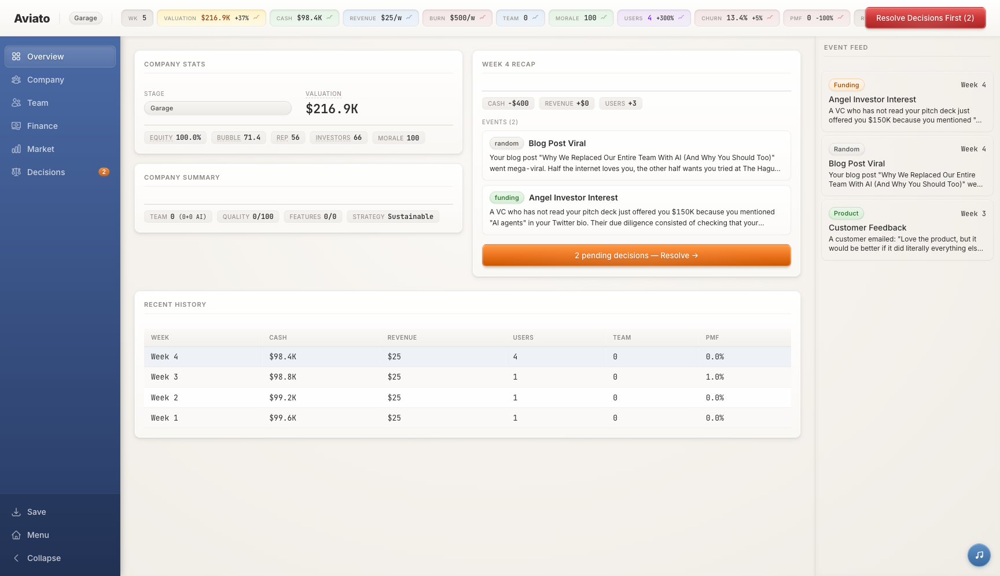

# Here Comes Another Bubble

> *Build your AI startup. Try not to die.*

A satirical startup simulation game set during the AI bubble. You play as a founder navigating the absurd world of Silicon Valley — hiring engineers, shipping features, raising funding, and desperately trying to IPO before the bubble pops and takes your valuation with it.

Inspired by [the 2007 song of the same name](https://www.youtube.com/watch?v=I6IQ_FOCE6I) about the original Web 2.0 bubble.

**[Play it now](https://herecomesanotherbubble.com)**



## Features

- **5 founder archetypes** — Technical Hacker, Visionary Hustler, Balanced Generalist, Ex-BigTech Corporate Refugee, Academic Researcher — each with different starting stats, cash, and playstyles
- **7 market segments** — AI DevTools, Healthcare, Fintech, Education, Enterprise, Consumer, and Creative Tools — with distinct economics, regulation risk, and competition
- **Week-by-week simulation** — manage cash flow, burn rate, hiring, product development, and growth strategy as time ticks forward
- **The Bubble Index** — a market-wide sentiment indicator that inflates valuations on the way up and wipes them out on the way down
- **Event system** — 100+ randomized events across categories: market shifts, team drama, product crises, funding opportunities, regulatory heat, and Silicon Valley absurdity
- **Decision-driven gameplay** — weekly decisions with real trade-offs that shape your company's trajectory
- **Multiple win conditions** — IPO, acquisition (your choice to accept), or reaching unicorn status
- **Multiple death conditions** — running out of cash, losing your entire team, regulatory shutdown, or just giving up
- **Scoring system** — letter grades (S through F) based on valuation, revenue, team size, and speed, with difficulty multipliers
- **Skeuomorphic Web 2.0 aesthetic** — tactile surfaces, layered shadows, glossy buttons, and a design that looks like it was built in 2007 (on purpose)
- **Background music** — the original "Here Comes Another Bubble" song plays via embedded YouTube

## Getting Started

### Prerequisites

- Node.js 18+
- Yarn

### Install & Run

```bash
git clone https://github.com/rokas-tarasevicius/here-comes-another-bubble.git
cd here-comes-another-bubble
yarn install
yarn dev
```

Open [http://localhost:5173](http://localhost:5173) in your browser.

### Other Commands

```bash
yarn build        # Type-check + production build
yarn lint         # ESLint
npx vitest run    # Run all tests (320 tests across 6 suites)
```

## Tech Stack

- **React 19** + **TypeScript** — strict mode, no enums, union types throughout
- **Vite 7** — dev server and production builds
- **Zustand 5** — single-store state management with immutable updates
- **Tailwind CSS v4** — utility-first styling with a custom retro design system
- **Recharts 3** — sparkline charts and data visualization
- **Vitest 4** — unit testing with jsdom environment

## Architecture

The game engine is **purely functional** — all simulation logic takes state in, returns new state out, never mutates. The React UI reads from a Zustand store that calls into the engine.

```
UI (React components) → Store (Zustand) → Engine (pure functions) → New State
```

```
src/
  engine/         # Pure game simulation (tick, events, scoring, derived metrics)
  store/          # Zustand store — bridges UI to engine
  components/
    layout/       # App shell, header, sidebar, event feed
    screens/      # One screen per game view (Overview, Company, Finance, Market, etc.)
    shared/       # Reusable components (KPICard, DecisionCard, charts, gauges)
  data/           # Static game data (founders, markets, competitors, 100+ events)
  types/          # All TypeScript types
```

## How to Play

1. **Name your startup** — or pick a ridiculous pre-made name
2. **Choose your founder** — each archetype has different strengths and starting cash
3. **Pick a market** — balance growth potential against competition and regulation
4. **Play week by week** — advance time, respond to events, and make strategic decisions
5. **Manage your resources** — hire/fire team members, set pricing, choose growth strategies, seek funding
6. **Watch the bubble** — when the Bubble Index is high, valuations soar; when it crashes, everyone suffers
7. **Try to win** — reach IPO ($1B+ valuation at public stage), get acquired, or become a unicorn

## Contributing

Contributions are welcome! The game is built to be extensible — adding new events, founder types, market segments, or game mechanics is straightforward.

1. Fork the repo
2. Create a feature branch (`feat/your-feature`)
3. Make your changes and add tests
4. Ensure `npx tsc -b` and `npx vitest run` pass
5. Open a PR

## Contributors

- [Rokas Tarasevicius](https://github.com/rokas-tarasevicius) — creator
- [Paulius Dovidaitis](https://github.com/Dovidaitis) — contributor
- [Claude](https://claude.ai) — Essentially wrote all the code (including this README)

## License

MIT
